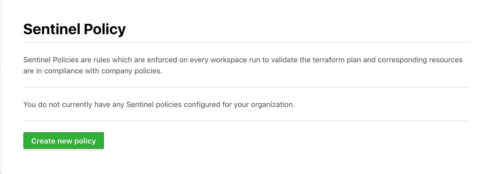
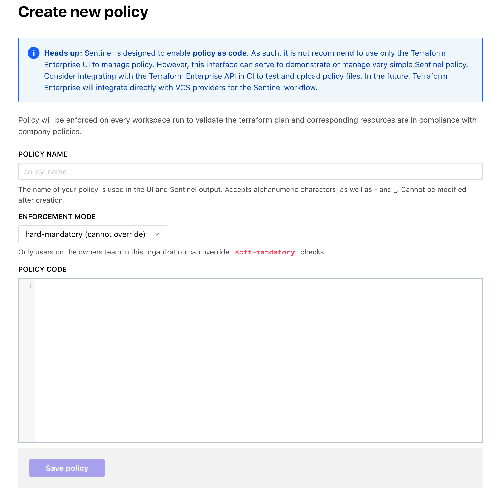

# 10 - Sentinel Policy with Terraform Enterprise

## Expected Outcome

In this challenge, you will see how you can apply policies around your Azure subscriptions using Sentinel Policies.
Using the TFE app and the API.

## How to

### View Polcies

In the Terraform Enterprise web app, click on your organization -> Organization Settings

https://app.terraform.io/app/YOUR_TFE_ORGANIZATION/settings/policies



### Create Policy in App

Click "Create new Policy"



### Create Policy from API

Create the following policy:

__Policy Name:__ ResourceGroupRequireTag

__Policy Enforcement:__ advisory (logging only)

__Policy Code:__

```hcl
import "tfplan"

main = rule {
  all tfplan.resources.azurerm_resource_group as _, instances {
    all instances as _, r {
      (length(r.tags) else 0) >= 0
    }
  }
}
```

### Run a Plan

Queue a plan for the workspace `app-dev`.

### Review the Plan

Will see the plan was sucessful but there was a policy failure, however the option to Apply is still available.

### Update the Policy

Update the Policy Enforcement to be `hard-mandatory`.

### Run a Plan

Queue a plan for the workspace `app-dev`.

### Review the Plan

This time the the run fails due to the hard enforcement.

### Update Workspace

In the `app-dev` workspace, add the following to the `azurerm_resource_group` declaration:

```hcl
resource "azurerm_resource_group" "module" {

...

  tags {
    Owner = "me"
  }
}
```

Save and commit the code to your reposistory.

### Run a Plan

Run another plan.

> Note: You may need to discard the last non-applied build.

### Review the Plan

The plan should succedd and now pass the sentinel policy check.

## Advanced areas to explore

1. Write another Sentinel Policy restricting VM types in Azure.

## Resources

- [Policy](https://app.terraform.io/app/cardinalsolutions/settings/policies)
